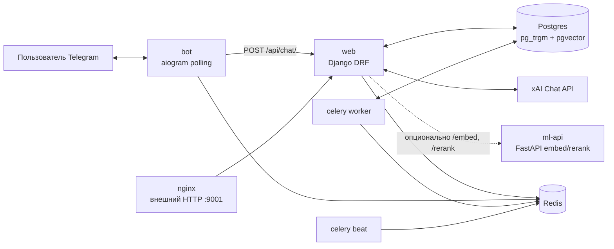
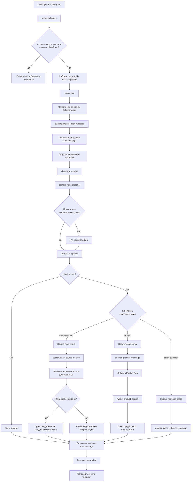
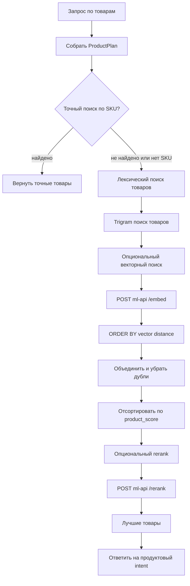

# Архитектура RAG

Этот документ описывает текущий путь запроса в Telegram RAG-боте. Схема
отдельно показывает обычный поиск по базе знаний и продуктовый поиск, потому
что в коде они используют разные стратегии поиска.

## Сервисы

## Pipeline запроса

## Гибридный поиск по товарам

## Заметки по текущей реализации

- Публичный Telegram-путь: `bot.main` -> `POST /api/chat/` -> `views.chat` ->
  `pipeline.answer_user_message`.
- Классификатор сначала запускает локальные domain rules. Если сообщение не
  является простым bypass-сценарием и задан `XAI_API_KEY`, он запрашивает у xAI
  JSON-классификацию.
- Ответы по обычной базе знаний используют `ClassifierClass` и активные строки
  `Source`. Сейчас `search.search()` направляет не-продуктовые запросы в
  `class_source_search()`.
- `quick_phrase_search()` есть в `backend/app/core/search.py`, но текущая
  функция `search()` его не вызывает.
- Embeddings для source/article в текущем core search отключены:
  `removed_embedding_status()` возвращает `status="removed"`, а
  `POST /api/index/prepare/` возвращает `{"status": "skipped",
  "reason": "embeddings_removed"}`.
- Поиск по товарам отделен от обычного source RAG. Он может использовать
  точный поиск по SKU, lexical search, trigram search, опциональный pgvector
  search через `ml-api /embed` и опциональный rerank через `ml-api /rerank`.
- Postgres используется и как основная база приложения, и как retrieval store.
  Redis используется для Celery и пользовательских lock-ов в боте.
