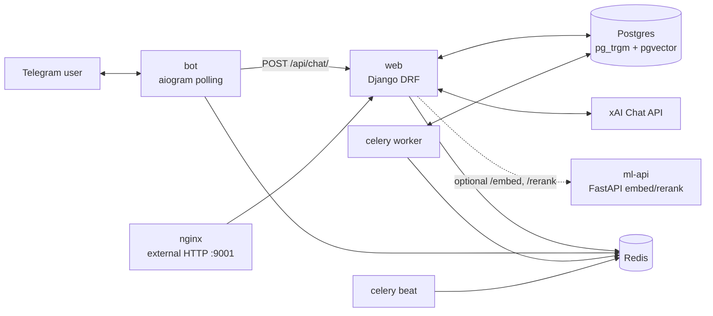
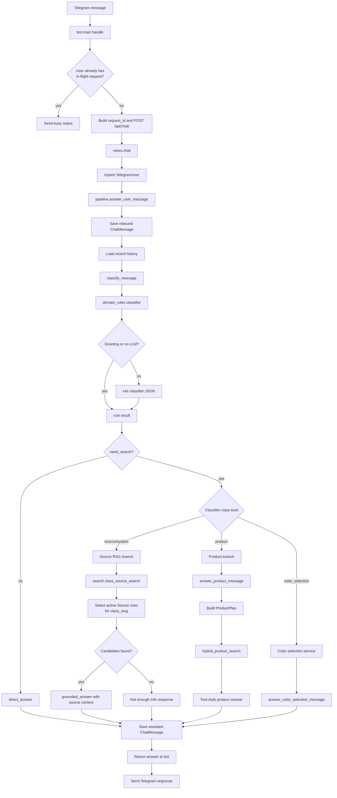
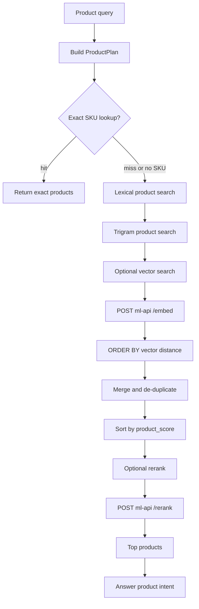

# RAG Architecture

This document describes the current request flow implemented by the Telegram
RAG bot. It intentionally separates the source knowledge-base path from the
product search path because they use different retrieval strategies.

## Runtime Services

## Request Pipeline

## Product Hybrid Search

## Current Implementation Notes

- The public Telegram path is `bot.main` -> `POST /api/chat/` -> `views.chat` ->
  `pipeline.answer_user_message`.
- The classifier first runs local domain rules. If the message is not a simple
  bypass case and `XAI_API_KEY` is configured, it asks the xAI chat model for a
  JSON classification.
- Source knowledge-base answers use `ClassifierClass` and active `Source` rows.
  `search.search()` currently routes non-product searches to
  `class_source_search()`.
- `quick_phrase_search()` exists in `backend/app/core/search.py`, but the current
  `search()` function does not call it.
- Source/article embeddings are disabled in the current core search path:
  `removed_embedding_status()` returns `status="removed"`, and
  `POST /api/index/prepare/` returns `{"status": "skipped",
  "reason": "embeddings_removed"}`.
- Product retrieval is separate from source RAG. It can use exact SKU lookup,
  lexical search, trigram search, optional pgvector search through `ml-api
  /embed`, and optional reranking through `ml-api /rerank`.
- Postgres is both the application database and the retrieval store. Redis is
  used for Celery and bot-side user locks.
